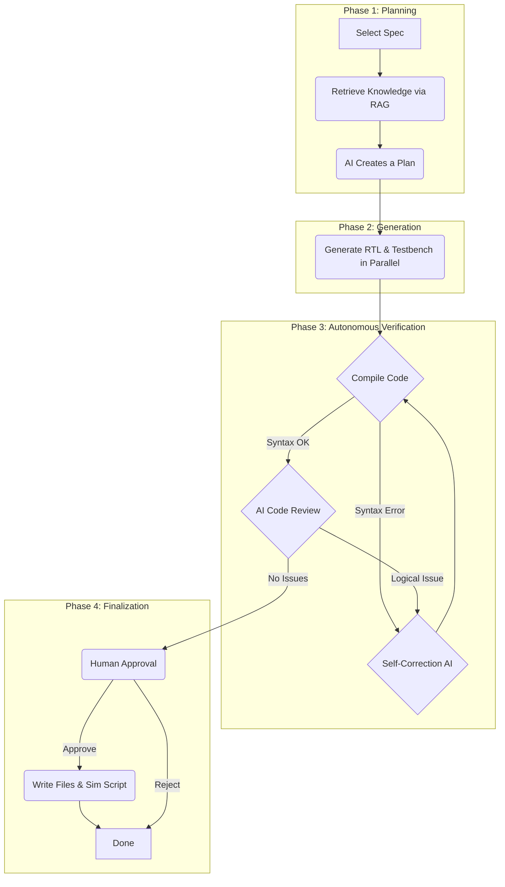

# Spec2RTL: AI-Powered Hardware Design & Verification Copilot

Spec2RTL is an autonomous AI assistant that transforms high-level hardware specifications into verified, ready-to-use Verilog RTL and a corresponding SystemVerilog testbench. It leverages a multi-agent workflow, a self-correction loop, and a custom knowledge base to automate the most tedious parts of the hardware design lifecycle.

This isn't just a code generator; it's a collaborative partner that plans, generates, validates, critiques, and refines its own work, presenting a polished result for final human approval.

<!--  -->

## Key Features

*   **Specification-Driven Design:** Takes a natural language markdown file as the single source of truth.
*   **Knowledge-Aware Generation (RAG):** Utilizes a custom knowledge base (e.g., for simulator-specific rules or project coding standards) to generate more accurate and compliant code.
*   **Autonomous Workflow:**
    *   **AI-Powered Planning:** First, it creates a high-level plan for how it will tackle the generation tasks.
    *   **Parallel Code Generation:** Generates RTL and testbench code concurrently for maximum speed.
*   **Self-Correction Loop:**
    *   **Automated Validation:** Uses `iverilog` to instantly check the generated code for syntax errors.
    *   **AI Self-Critique:** An AI agent acts as a peer reviewer, checking the code for logical flaws, coverage gaps, and inconsistencies.
    *   **Recursive Debugging:** If any errors are found (either by the compiler or the AI critique), the system automatically attempts to fix them and re-validates, looping until the code is correct.
*   **Human-in-the-Loop:** You are the final authority. The AI presents the validated, verified code for your approval before any files are written.

---

## How It Works

Spec2RTL orchestrates a sophisticated multi-agent workflow:



---

## Getting Started

### Prerequisites

1.  **Python:** 3.10 or newer.
2.  **A C Compiler:** `gcc` is required for one of the dependencies.
3.  **Icarus Verilog:** The tool used for code validation.
    *   On Ubuntu/Debian: `sudo apt-get install iverilog`
    *   On macOS (with Homebrew): `brew install icarus-verilog`
4.  **An AI Backend:** You need access to an AI model, either locally via **Ollama** or through the cloud via **Azure OpenAI**.

### 1. Clone the Repository

```bash
git clone https://github.com/cirkitly/spec2rtl.git
cd spec2rtl
```

### 2. Set Up Your Environment

It's highly recommended to use a virtual environment.

```bash
# Create a virtual environment
python3 -m venv env

# Activate it
source env/bin/activate

# Install all required Python packages
pip install -r requirements.txt
```

### 3. Configure the AI Backend

The application uses a `.env` file to manage API keys and endpoints. First, create your own `.env` file by copying the example:

```bash
cp .env.example .env
```

Next, open the new `.env` file and fill it out according to **one** of the options below.

---

#### **Option A: Azure OpenAI (Recommended)**

Edit your `.env` file to look like this, replacing the placeholders with your actual Azure credentials.

```dotenv
# .env file for Azure
LLM_PROVIDER="azure"

AZURE_OPENAI_ENDPOINT=https://<your-resource-name>.openai.azure.com/
AZURE_OPENAI_API_KEY=<your-azure-openai-key>
AZURE_OPENAI_DEPLOYMENT=<your-deployment-name>
AZURE_OPENAI_API_VERSION=2024-05-01-preview
```
*Note: `AZURE_OPENAI_DEPLOYMENT` is the custom name you gave the model when you deployed it in Azure.*

---

#### **Option B: Ollama (Local & Private)**

If you prefer to run models locally, first download and run [Ollama](https://ollama.com/). Then, pull the required models from your terminal:

```bash
# 1. Download the main language model (for writing code)
ollama pull llama3

# 2. Download the embedding model (for RAG)
ollama pull mxbai-embed-large
```

The `.env.example` is already set up for Ollama, so you just need to ensure `LLM_PROVIDER="ollama"` is set in your `.env` file.

---

## How to Use Spec2RTL

#### Step 1: Add Your Specifications

Place your hardware module specifications as `.md` files inside the `specs/` directory. A `uart_spec.md` is included as an example.

#### Step 2: (Optional) Add to the Knowledge Base

Place any relevant documentation, coding standards, or compatibility rules as `.txt` files in the `knowledge_source/` directory. The AI will use this information to generate better, more compliant code.

#### Step 3: Run the Copilot!

From the project's root directory, run the main script:

```bash
python3 main.py
```

#### Step 4: Collaborate with the AI

1.  **Select a Spec:** The tool will list all specifications it found. Enter the number corresponding to the one you want to work on.
2.  **Watch it Work:** The AI will create a plan, generate the code, and run its validation and self-critique loops. You will see status updates in real-time.
3.  **Approve the Result:** Once the AI is satisfied with its work, it will present the final Verilog RTL and SystemVerilog testbench for your review. If you approve, it will save the files.

#### Step 5: Run Your New Simulation

The generated files will be placed in a new directory inside `output/`.

```bash
# Navigate to the output directory
cd output/uart_spec

# Run the simulation script
./run_sim.sh
```

You should see the `iverilog` compilation and the testbench execution results printed to your console. Congratulations, you've gone from spec to simulation in minutes