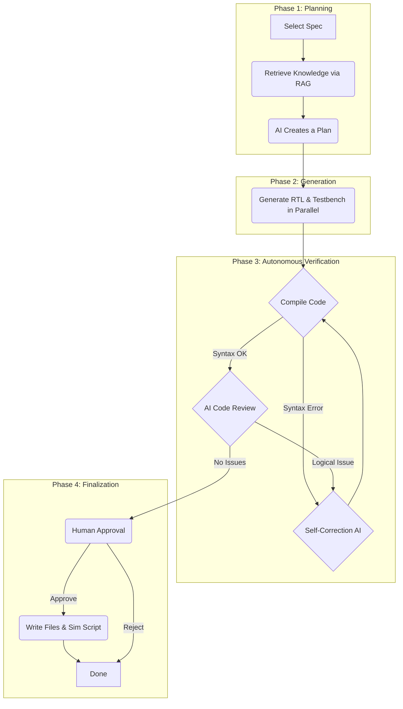

# Architecture

Spec2RTL orchestrates a sophisticated multi-agent workflow:

```mermaid
flowchart TD
    subgraph "Phase 1: Planning"
        A[Select Spec] --> B(Retrieve Knowledge via RAG)
        B --> C(AI Creates a Plan)
    end
    
    subgraph "Phase 2: Generation"
        C --> D(Generate RTL & Testbench in Parallel)
    end

    subgraph "Phase 3: Autonomous Verification"
        D --> E{Compile Code}
        E -- Syntax OK --> F{AI Code Review}
        E -- Syntax Error --> G{Self-Correction AI}
        F -- Logical Issue --> G
        G --> E
    end
    
    subgraph "Phase 4: Finalization"
        F -- No Issues --> H(Human Approval)
        H -- Approve --> I(Write Files & Sim Script)
        I --> Z[Done]
        H -- Reject --> Z
    end
```
